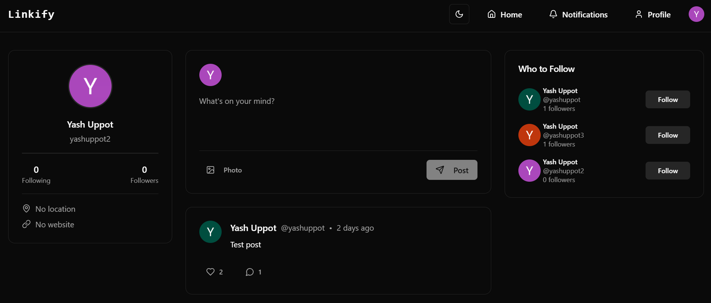

## Linkify

A social media app that's being built based on the concept that social media should inherently foster *real world* communication. 

Check out the first version live [here](https://linkify-social-media.vercel.app/) or see the code in the repo

## Features  
- Secure user sign-up and login using Clerk  
- Users can create posts with text and images  
- Upload and store images securely  
- Like posts
- Customizable user profiles with bio and profile picture  
- View other users profiles and posts  
- Personalized feed based on followed users  
- Recommended follows feature to suggest new connections  
- Users can delete their own posts  
- Search for users by username  

## Tech Stack  
- **Frontend:** Next.js, React  
- **Backend:** Prisma, PostgreSQL  
- **Hosting:** Vercel
